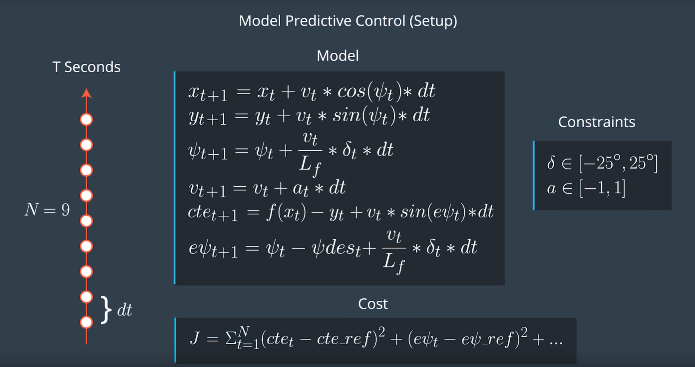

# CarND-Controls-MPC


## Model description
This project is aimed to create MPC-Control to make a car follow reference trajectory as close as possible. Simulation is running inside of Udacity simulator.

MPC Model includes following parameters:
- x and y car coordinates
- velocity
- car orientation angle

Following error types are applicable to the model:
- cross track error (cte)
- orientation error (psi error)

Model calculates current step parameters based on previous step parameters for given steps count and time step size.


## N and dt values
Choosen values are N = 9 and dt = 0.1. Such values provide quite good performance and latency. Many combinations were being tried like: 15/0.05; 12/0.07; 20/0.02; 10/0.2; 9/0.15 etc.

Dt value reflects how frequent optimizer will set a corrective trajectory. So, smaller Dt values can provide better accuracy because trajectory corrections will be performed more frequently.

N value means how many steps to the future prediction model will see to find optimal actuators values. Larger N values need more computational time, so it is not always reasonable to have large N.

In general larger time horizon N*dt can give better driving accurcy on high speed because there is more information required to make effective driving actions on hight speed.

## Polynomial Fitting and MPC Preprocessing
Waypoint coordinates were transformed to vehicle coodinate system (origin position is a vehicle position at (0, 0)).
Polyfit and polyeval functions were being used to find coefficients from given waypoints. See transformWayPoints function in main.cpp.

## Model Predictive Control with Latency
Latency problem was solved using actuator values from more previous steps (current step - 2). For init step there was made the latency simulation.
Also for hard turns there was penaltized high velocity. So velocity * steering_angle value penaltizes cost function to have safer car behaviour on turns (break on turns).

---

## Dependencies

* cmake >= 3.5
 * All OSes: [click here for installation instructions](https://cmake.org/install/)
* make >= 4.1(mac, linux), 3.81(Windows)
  * Linux: make is installed by default on most Linux distros
  * Mac: [install Xcode command line tools to get make](https://developer.apple.com/xcode/features/)
  * Windows: [Click here for installation instructions](http://gnuwin32.sourceforge.net/packages/make.htm)
* gcc/g++ >= 5.4
  * Linux: gcc / g++ is installed by default on most Linux distros
  * Mac: same deal as make - [install Xcode command line tools]((https://developer.apple.com/xcode/features/)
  * Windows: recommend using [MinGW](http://www.mingw.org/)
* [uWebSockets](https://github.com/uWebSockets/uWebSockets)
  * Run either `install-mac.sh` or `install-ubuntu.sh`.
  * If you install from source, checkout to commit `e94b6e1`, i.e.
    ```
    git clone https://github.com/uWebSockets/uWebSockets
    cd uWebSockets
    git checkout e94b6e1
    ```
    Some function signatures have changed in v0.14.x. See [this PR](https://github.com/udacity/CarND-MPC-Project/pull/3) for more details.

* **Ipopt and CppAD:** Please refer to [this document](https://github.com/udacity/CarND-MPC-Project/blob/master/install_Ipopt_CppAD.md) for installation instructions.
* [Eigen](http://eigen.tuxfamily.org/index.php?title=Main_Page). This is already part of the repo so you shouldn't have to worry about it.
* Simulator. You can download these from the [releases tab](https://github.com/udacity/self-driving-car-sim/releases).
* Not a dependency but read the [DATA.md](./DATA.md) for a description of the data sent back from the simulator.


## Basic Build Instructions

1. Clone this repo.
2. Make a build directory: `mkdir build && cd build`
3. Compile: `cmake .. && make`
4. Run it: `./mpc`.
