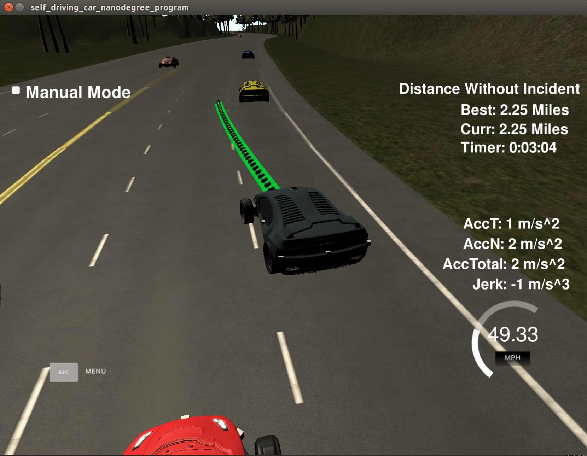
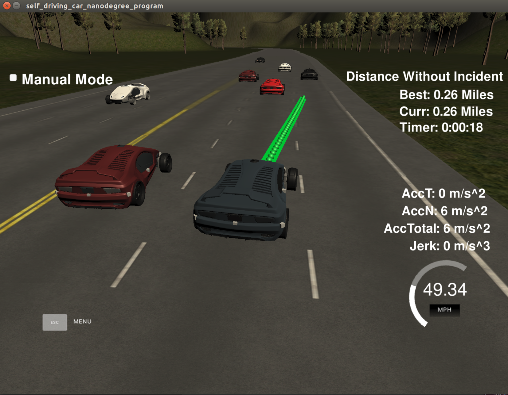

# Path Planning Project

## Project goals

Aim of current project is to build path planning algorithm to allow car to drive and navigate on highway full 
of traffic and other vehicles. Car should keep speed limit 50 MPH but not drive too slow.
Car should pass slower vehicles and take into account faster vehicles.

Input of algorithm is sensor data and sparse map of waypoints on the highway. 

The map of the highway is in data/highway_map.txt.

## Requirements and restrictions

- Speed limit 50 MPH
- Car should pass complete 6946m highway loop 
- About 5 minutes should be needed to pass loop
- Acceleration limit - over 10 m/s^2 
- Max allowed jerk - 10 m/s^3

## Implementation

---
### Input data and params

- Car parameters are being processed in real time

```

["x"] The car's x position in map coordinates

["y"] The car's y position in map coordinates

["s"] The car's s position in frenet coordinates

["d"] The car's d position in frenet coordinates

["yaw"] The car's yaw angle in the map

["speed"] The car's speed in MPH
```

- Following parameters are set for current algorithm:
```Parameters that are used in current project:

double left_distance = 1000; 
double right_distance = 1000; 

double speed_limit = 49.5;
double speed_change = 0.225;

double time_step = 0.01;

double min_distance_infront = 20;
double min_distance_back = 10;
```
### Algorithm:

- For every other vehicle:

    - get vehicle speed
    
    - get next position based on speed and current position
    
    - identify given vehicle lane using freenet coords
    
    - identify if given vehicle is too close to our car
    
    - identify if it is possible to go left or right
    
    - calculate gaps from left and from right in order to choose where to go if needed

- Make decision about next actions based on previous step info (go left, right or keep lane)

- Control speed, acceleration and jerk using other vehicles positions and parameters

- Trajectory is generated based on project instruction video

## Algorithm results:

- Car runs more than 1 loop without problems
- Speed limit is not exceeded
- Acceleration and jerk limits are not exceeded
- No collisions during the loop
- The car is keeping lane, is able to change lanes and pass slower vehicles and break in front of faster

Example screenshots:





## How to build and run

1. Clone repo
2. Generate build directory: `mkdir build && cd build`
3. Compile project: `cmake .. && make`
4. Execute command: `./path_planning`


## Dependencies

* cmake >= 3.5
  * All OSes: [click here for installation instructions](https://cmake.org/install/)
* make >= 4.1
  * Linux: make is installed by default on most Linux distros
  * Mac: [install Xcode command line tools to get make](https://developer.apple.com/xcode/features/)
  * Windows: [Click here for installation instructions](http://gnuwin32.sourceforge.net/packages/make.htm)
* gcc/g++ >= 5.4
  * Linux: gcc / g++ is installed by default on most Linux distros
  * Mac: same deal as make - [install Xcode command line tools]((https://developer.apple.com/xcode/features/)
  * Windows: recommend using [MinGW](http://www.mingw.org/)
* [uWebSockets](https://github.com/uWebSockets/uWebSockets)
  * Run either `install-mac.sh` or `install-ubuntu.sh`.
  * If you install from source, checkout to commit `e94b6e1`, i.e.
    ```
    git clone https://github.com/uWebSockets/uWebSockets 
    cd uWebSockets
    git checkout e94b6e1
    ```
