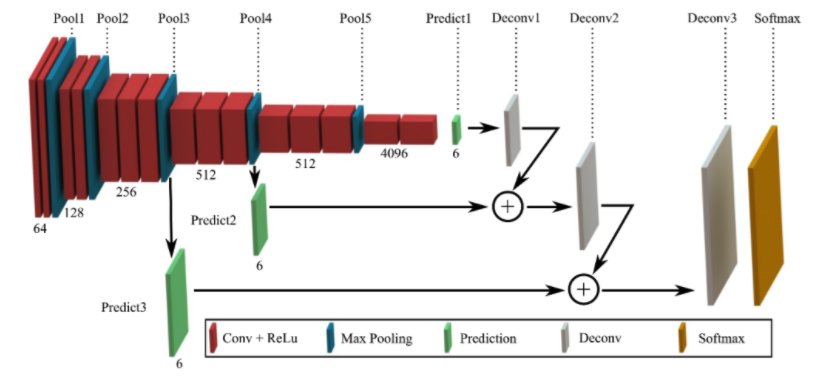
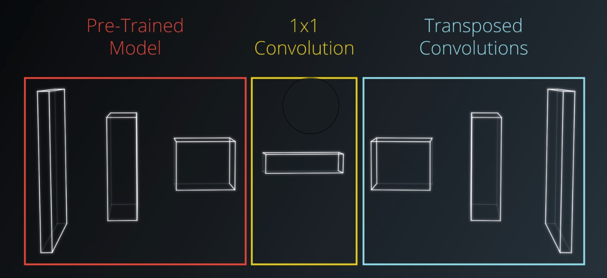
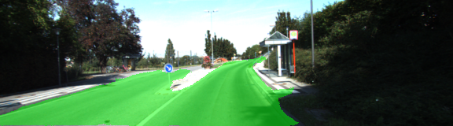
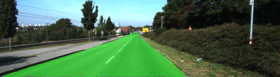
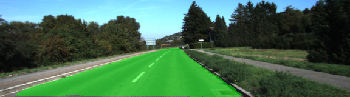
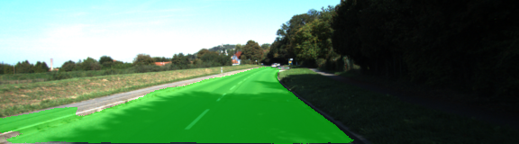
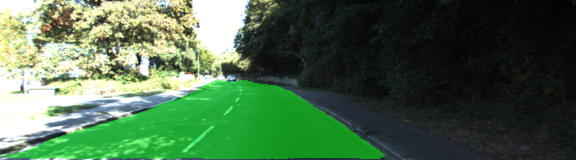
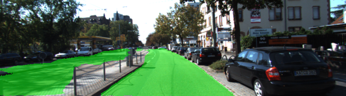

# Semantic-Segmentation

## Description

The aim of project is to create deep convolutional neural network identifying drivable path (like road surface) on the image.

## Used existing datasets and models

There were being used:
 - Kitti Road dataset Link [http://www.cvlibs.net/datasets/kitti/eval_road.php]
 - VGG16 model (pretrained) Link [https://s3-us-west-1.amazonaws.com/udacity-selfdrivingcar/vgg.zip]

## FCN (fully convolutional network) architecture

To save the spacial information for the image and locate the object on a part of image, 
we need a technique which preserves this information.

FCN provides huge benefit: FCN architecture allows to save spacial information that is lost in simple convolutional networks
and allows to locate the object on a part of image:




FCN consists of following steps:

1. For general pretrained CNN fully connected layer is converted to 1x1 convolution layer.

2. Deconvolution is applied to output of 1x1 convolution layer (Upsample).

3. Adding skip layer that adds conv 1x1 output to deconvoluted output.

Architecture is generally called Encoder-decoder pattern, where: 
 - pretrained model is Encoder
 - deconvolution model is Decoder



## Current model layers description

 1. VGG16 model was being used as pretrained general CNN (Encoder)

 2. Add layer for deconvolution, where Vgg 7 output is feed and converted to 1x1 convolution. 

 3. Transpose convolution (upsample) - 1x1 image is upsampled to original size image.  
  
 4. Add skip layer. For skipping connections Vgg 4 layer 1x1 convolution result is added elementwise to deconvoluted Vgg 7 output result (step 3 result)
 
 5. Upsample prev skip layer result and add skip layer with 1x1 convoluton for vgg layer 3 output
 
 6. Upsample prev skip layer result and generate output pixels
 
 
## Training process desriotion

1. Load VGG model
2. Connect VGG outputs (Encoder) with custom layers (Decoder, descibed above) 
3. Use AdamOptimizer for effective learning.
4. Train and run the model.
5. Save generated outputs as images.

### Model tuned parameters

 - Epochs            : 50
 - Batch size        : 7
 - Learning rate     : 0.0001
 - Keep Probability  : 0.6

### Setup and run

##### Dependencies

Before running the project you should have:
 - [Python 3](https://www.python.org/)
 - [NumPy](http://www.numpy.org/)
 - [SciPy](https://www.scipy.org/)
 - [TensorFlow](https://www.tensorflow.org/)

##### How to run
To tun project execute following command:
```
python main.py
```

## Result output images

Output image 1:



Output image 2:



Output image 3:



Output image 4:



Output image 5:



Output image 6:




