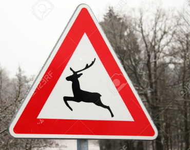

## Build a Traffic Sign Recognition Project

The goals / steps of this project are the following:
* Load the data set (see below for links to the project data set)
* Explore, summarize and visualize the data set
* Design, train and test a model architecture
* Use the model to make predictions on new images
* Analyze the softmax probabilities of the new images
* Summarize the results with a written report

[//]: # (Image References)

[image1]: examples/sign_distribution.png "Visualization"
[image2]: examples/generated_images.png "Generated images"
[image3]: examples/before_and_after_processing.png "Before and after"
[image4]: test_examples_web/im1.jpg "Traffic Sign 1"
[image5]: test_examples_web/im2.jpg "Traffic Sign 2"
[image6]: test_examples_web/im3.jpg "Traffic Sign 3"
[image7]: test_examples_web/im4.jpg "Traffic Sign 4"
[image8]: test_examples_web/im6.jpg "Traffic Sign 5"
[image9]: test_examples_web/im7.jpg "Traffic Sign 6"
[image10]: test_examples_web/im8.jpg "Traffic Sign 7"
[image11]: test_examples_web/im9.jpg "Traffic Sign 8"
[image12]: test_examples_web/im10.jpg "Traffic Sign 9"
[image13]: test_examples_web/im11.jpg "Traffic Sign 10"

[image14]: examples/softmax_bars.png "Softmax 1"
[image15]: examples/softmax_2.png "Softmax 2"

## Rubric Points

### Data Set Summary & Exploration

#### 1. Basic summary of the data set.

The numpy library was being used to calculate summary statistics of the traffic
signs data set:

* The initial size of training set is 34799 (after generating new images with random transformations - 139196)
* The size of the validation set is 4410
* The size of test set is 12630
* The shape of a traffic sign image is 32X32
* The number of unique classes/labels in the data set is 43

#### 2. Include an exploratory visualization of the dataset.

Below is traffic sign type distribution bar chart. It shows the number of training examples for each trafic sign type:

![alt text][image1]

### Design and Test a Model Architecture

#### 1. Describe how you preprocessed the image data. 

For better learning and higer accuracy additional train data was generated from existing images using random transformations. 
For each training example was generated 3 additional images applying random effects.
Transformation pipeline for generating each image is following:
- random rotation of image
- random scaling of image
- random warp of image
- random translation

Above techniques can help to imitate image distortions to improve training set and regularize network for better work with new examples.
Here is an example of an original image and generated images:

![alt text][image2]

Another important step is image preprocessing.

Image preprocessing has following steps:
- Gaussian Blur was being used for reducing image noise and redundant details
- Zoom (crop) image for more focusing network on ROI (region of interest)
- Normalize image pixels for uniform and smooth weights correction during backprop
- cv2.normalize function with NORM_MINMAX (same reason)
- Grayscale is not being used by default because color is one of important features of traffic sign and it can help to identify it's class

Here are examples of a traffic signs image before and after processing:

![alt text][image3]

#### 2. Describe what your final model architecture looks like including model type, layers, layer sizes, connectivity, etc.) Consider including a diagram and/or table describing the final model.

I have tried 3 types of architecture. The final model is modification of LeNet model with more convolutional filters, more fully connected neurons and dropouts. 
The final model consisted of the following layers:

| Layer         		|     Description	        					| 
|:---------------------:|:---------------------------------------------:| 
| Input         		| 32x32x3 RGB image   							| 
| 5x5 convolution     	| 1x1 stride, valid padding, outputs 28x28x32 	|
| RELU					|												|
| 2x2 max pool	      	| 2x2 stride,  outputs 14x14x32 				|
| 5x5 convolution	    | 1x1 stride, valid padding, outputs 10x10x64			|
| ReLU		| etc.        									|
| 2x2 max pool				| 2x2 stride,  outputs 5x5x64        									|
| Flatten output				| 5x5x64 -> 1600       									|
| Fully connected layer				| input: 1600, output: 300        									|
| ReLu				|         									|
| Dropout				| keep_prop = 0.75        									|
| Fully connected layer				| input: 300, output: 84			|
| ReLu			|        									|
| Dropout				| keep_prop = 0.75        									|
| Fully connected layer				| input: 84, output: 43				|
 

#### 3. Model training process description.

For training the model Adam optimizer was being used with optimal learning rate for weights correction = 0.001. 
Training the model I have tried to run it with different learning rate values (0.002, 0.01, 0.0001). 
Batch 64 was choosen (128 and 64 was tested).
Number of epochs is 25.
Dropout keep_probability is 0.75.

#### 4. Describe the approach taken for finding a solution and getting the validation set accuracy to be at least 0.93. Include in the discussion the results on the training, validation and test sets and where in the code these were calculated. Your approach may have been an iterative process, in which case, outline the steps you took to get to the final solution and why you chose those steps. Perhaps your solution involved an already well known implementation or architecture. In this case, discuss why you think the architecture is suitable for the current problem.

My final model results were:
* training set accuracy of 99,7%
* validation set accuracy of 98,5% 
* test set accuracy of 97,73%

Iterative approach was chosen:
* Simple LeNet was choosen as the first basic architecture because it's quite universal for image classification. Batch size = 128, no dropout, epochs = 10
* Test accuracy of initial model was quite good (94.86%) but I decided to improve it to more accuracy. It was a bit underfitted. Percission for separate signs was not so high (0,7-0,8)
* 3-d conv layer was added to identify more complex patterns and more convolutional filters for generating more feature
* Batch size is decreased to 64 and number of epochs increased to 20, dropout is being added with keep prob dropout. 
Dropout is being used for avoid overfitting. Number of epochs 20 allowed model obtain higher accuracy. 
Test accuracy has increased to 96.37%, validation 97,4%, train 99,5%
* In final model was decided to use 2 conv layers but more convolutional filters to generate more features and depth. 
Also the number of fully connected neurons was increased. The number of epochs was increased to 25. These changes have allowed to obtain 99,7 training accuracy, 98,5% validation accuracy, 97,73% test accuracy
* The most useful model changes were adding more convolutional filters (generating more features and depth), adding more fully connected neurons, using dropout for avoiding overfitting and making weights more autonomous (decreasing weights crossdependency on each other), adding more epochs

### Test a Model on New Images

#### 1. German traffic signs found on the web with the report.

Here are ten German traffic signs that I found on the web:

 ![alt text][image5 =150x140] ![alt text][image6 =150x140] 
![alt text][image7 =150x140] ![alt text][image8 =150x140] ![alt text][image9 =150x140]
![alt text][image10 =150x140] ![alt text][image11 =150x140] ![alt text][image12 =150x140]
![alt text][image13 =150x140]

The first image might be difficult to classify because ...

#### 2. Discussing the model's predictions on these new traffic signs 

Here are the results of the prediction:

| Image			        |     Prediction	        					| 
|:---------------------:|:---------------------------------------------:| 
| Children Corssing      		| Stop sign   									| 
| Right-of-way at the next intersection     			| U-turn 										|
| No passing					| No passing											|
| Roundabout mandatory	      		| Roundabout mandatory					 				|
| No entry			| No entry      							|
| Wild animals crossing      		| Wild animals crossing   									| 
| Keep right     			| Keep right 										|
| Beware of ice/snow					| Slippery road											|
| Road work	      		| Road work					 				|
| Beware of ice/snow			| Beware of ice/snow      							|

We have obtained quite good accuracy for unknown test images set (90%). 
9 of 10 images were classified correctly. 
Accuracy for new web images is a bit less than test set accuracy (97,76%). 
There is one missclasification for trafic sign covered by snow. 
But this is quite specific case and we just have to enhance training set for such specific cases (add more complex examples). 

#### 3. How certain the model is when predicting on each of the five new images (TOP 5 softmax propabilities)

Lets show TOP 5 classes probabilities for random traffic signs images:

![alt text][image13]
![alt text][image14]

As we can see above the model is quite certain of its predictions. In most cases the single class takes totally leadership. There was some uncertainity for case 1 and case 4. 
- Traffic sign in case 4 (Roundabout mandatory) realy has some patterns of "Turn left ahead" sign (left arrow). 
- Also, traffic sign in case 1 (Children crossing) realy has some elements of "Slippery road" sign (childrens shapes are quite similar to two paralel zigzag lines :)).

